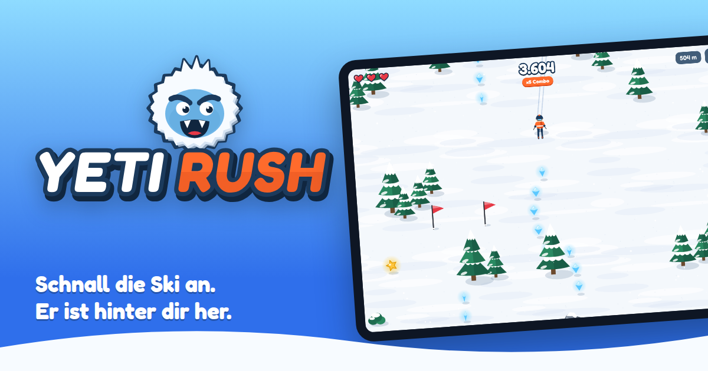

# Yeti Rush



**Yeti Rush** ist ein Ski-Arcade-Spiel für das iPad. Du fährst eine endlose Piste hinunter, springst über Schanzen, zeigst Tricks, sammelst Kristalle und fährst dem Yeti davon.

Alles wurde von Grund auf neu gebaut: Engine, Grafiken, Musik und Sounds, Logo, App-Icon und Website.

| Ordner | Inhalt |
|---|---|
| `game/` | Das Spiel (HTML5 Canvas + JavaScript, ohne Abhängigkeiten, als PWA offline spielbar) |
| `ios/` | Native iPadOS-App (Xcode-Projekt, SwiftUI + WKWebView, Haptik, App-Icon, Privacy-Manifest, App-Store-Texte) |
| `website/` | Landingpage, Presse-Kit, Datenschutz, Impressum; die spielbare Web-Version liegt unter `website/play/` |
| `brand/` | Logo, Wortmarke, Yeti-Maskottchen, App-Icon (SVG + PNG in allen Größen) |
| `tools/` | Build-Skripte für die Brand-Assets, die PNG-Exporte, die Screenshots und den Sync |

## Spielen

- **Im Browser:** `npm run serve` ausführen und dann http://localhost:8080/game/ öffnen. Mit Tastatur lenkst du über die Pfeiltasten, Leertaste macht einen Trick, `P` pausiert.
- **Auf dem iPad als Web-App:** die Website veröffentlichen, `…/play/` in Safari öffnen und über Teilen → „Zum Home-Bildschirm“ installieren.
- **Als native App:**
  1. `ios/YetiRush.xcodeproj` in Xcode 15 oder neuer öffnen.
  2. Unter *Signing & Capabilities* dein Team auswählen und die Bundle-ID anpassen (`com.yetirush.game`).
  3. Ein iPad oder den iPad-Simulator wählen und ⌘R drücken.

## Spielmechanik

- **Lenken:** Finger links oder rechts neben den Skifahrer halten. Je weiter weg, desto schärfer die Kurve. Alternativ die Neige-Steuerung verwenden.
- **Schanzen:** in der Luft tippen für 360, Salto oder Grab. Wer mitten im Trick landet, stürzt.
- **Combo:** Kristalle, Tore und Tricks erhöhen den Multiplikator bis ×5. Ein Sturz, ein verpasstes Tor oder 6 Sekunden ohne Aktion setzen ihn zurück.
- **Hindernisse:** Tannen, Felsen, Baumstümpfe und Schneemänner kosten ein Leben. Buckel bremsen dich. Auf Eis kannst du nicht lenken.
- **Power-ups:** Heißer Kakao gibt ein Leben zurück, der goldene Stern gibt Turbo und macht unverwundbar.
- **Der Yeti:** wacht bei 1.000 m auf und danach alle 900 bis 1.400 m wieder. Wer ihn 15 Sekunden abhängt, bekommt +500 Punkte. Wird man erwischt, ist das Spiel sofort vorbei.
- Die Piste wird deterministisch in Zellen generiert und mit der Strecke schwieriger (höheres Tempo, mehr Felsen, engere Tore).

## Assets

- **Grafik:** Alle Sprites entstehen prozedural mit Canvas-2D-Pfaden (`game/js/art.js`) und werden pro Zoomstufe gecacht.
- **Audio:** Musik (Loop in C-Dur, 128 BPM, eigene Jagd-Variante) und alle Effekte werden live mit der Web Audio API synthetisiert (`game/js/audio.js`). Es gibt keine Audiodateien.
- **Logo und Icon:** werden per Code erzeugt (`tools/build-brand.mjs`). Die Wortmarke wird mit opentype.js in Pfade umgewandelt.
- **Screenshots:** werden automatisiert aus dem echten Spiel aufgenommen (`tools/render-assets.mjs`).
- **Schrift:** Fredoka, SIL Open Font License 1.1 (`game/fonts/OFL.txt`). Das ist das einzige Fremd-Asset.

## Assets neu bauen

```bash
npm install
npm run build   # Brand-SVGs, PNGs und Screenshots erzeugen, dann nach game/, website/ und ios/ kopieren
```

Nach Änderungen in `game/` immer `npm run sync` ausführen. Dadurch landet die aktuelle Version auch in der iPad-App (`ios/YetiRush/Game`) und auf der Website (`website/play`).

## Website veröffentlichen

Der Workflow `.github/workflows/pages.yml` veröffentlicht `website/` bei jedem Push auf `main` auf GitHub Pages. Dafür muss GitHub Pages einmalig aktiviert werden (Settings → Pages → Source: GitHub Actions). **Vor dem Livegang müssen im Impressum und in der Datenschutzerklärung die gelb markierten Platzhalter ausgefüllt werden.**
