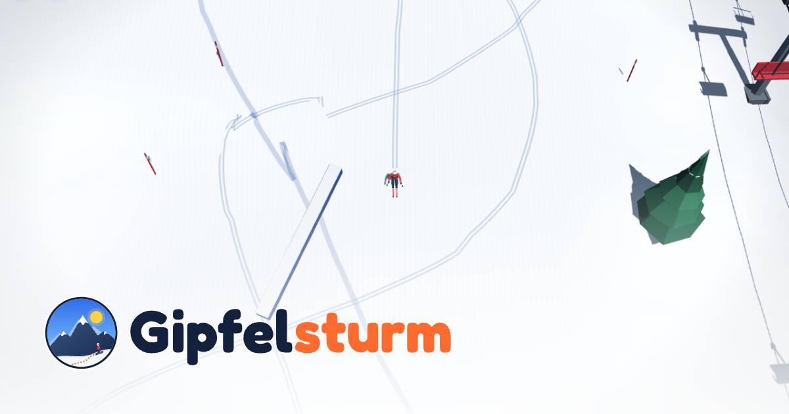
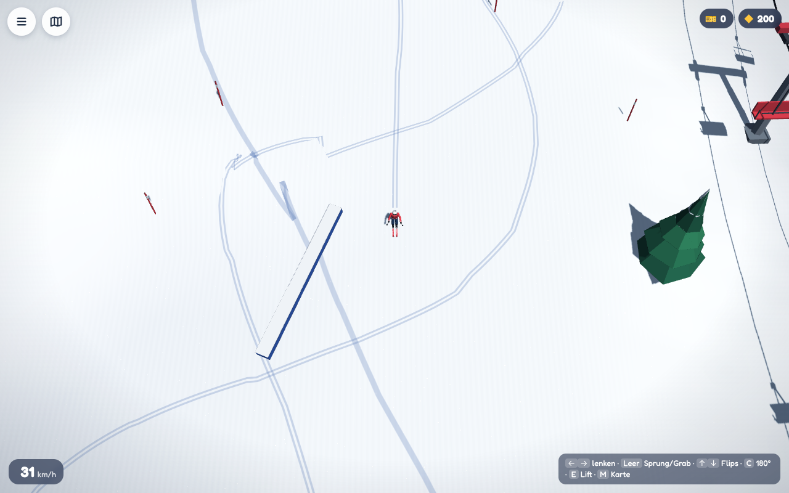
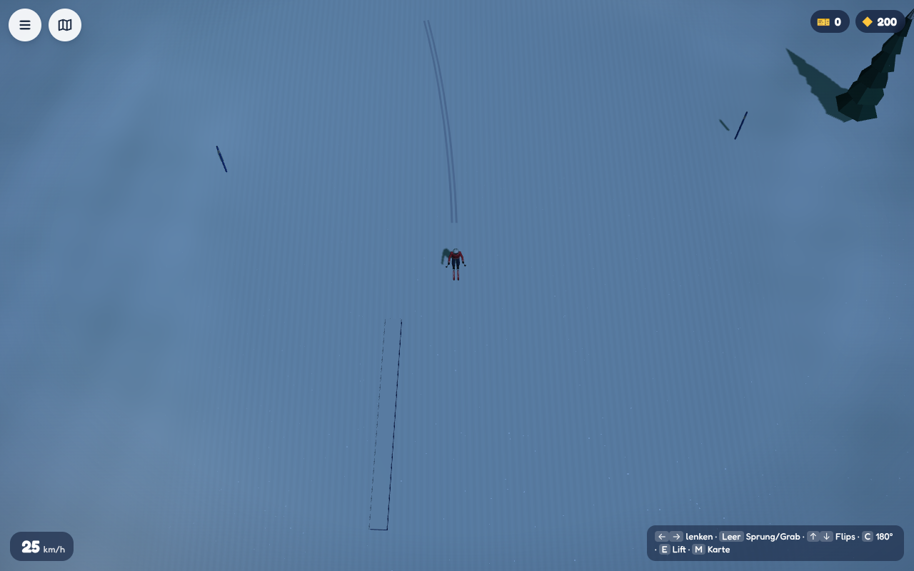
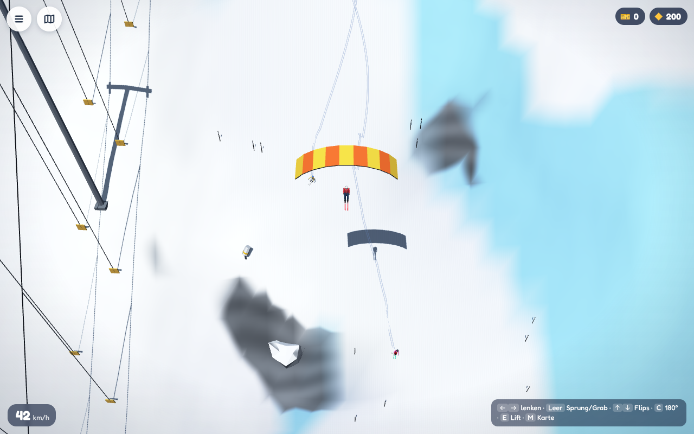
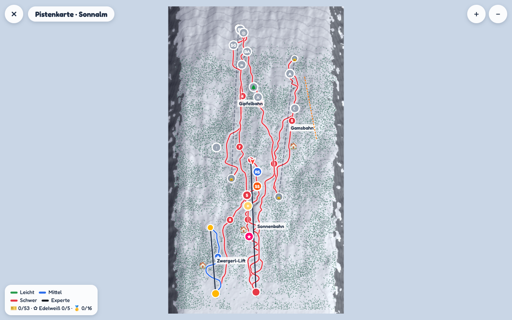
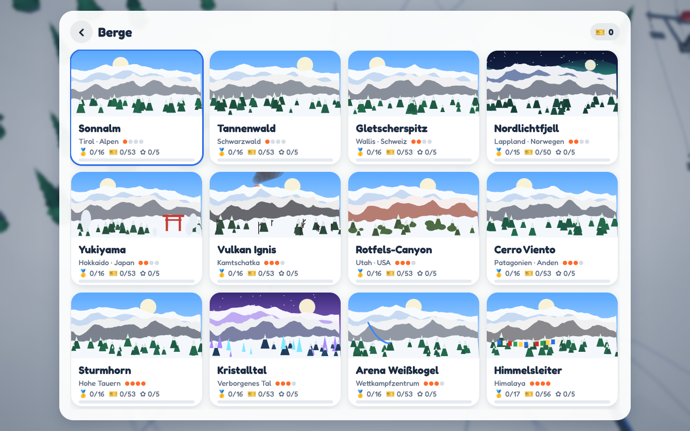
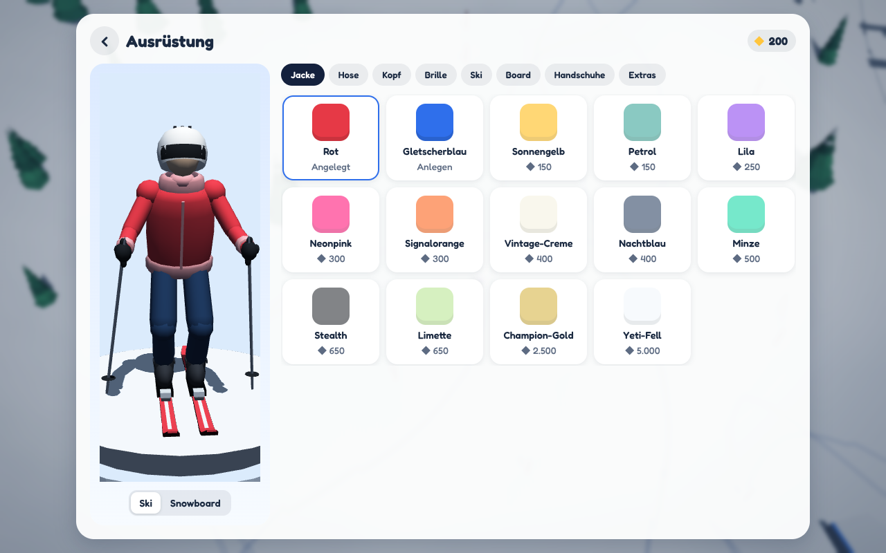

# Gipfelsturm



**Gipfelsturm** ist ein kostenloses Open-World-Ski- und Snowboardspiel für Browser, iPad, iPhone, Android und Desktop – inspiriert vom Spielgefühl von *Grand Mountain Adventure 2*, aber komplett selbst gebaut: eigene 3D-Engine, eigene Grafiken, eigene Musik, eigene Berge. Es gibt keine Käufe und keine Werbung; alles wird durch Spielen freigeschaltet (oder sofort über *Einstellungen → Alles freischalten*).

> Hinweis: Gipfelsturm übernimmt **keine** Grafiken, Modelle, Sounds, Namen oder Logos aus Grand Mountain Adventure. Spielmechaniken (Open-World-Skigebiet, Lifte, Challenges, Tricks) sind nachempfunden, alle Inhalte sind neu erzeugt.

| | |
|---|---|
|  |  |
|  |  |
|  |  |

## Spielen

```bash
npm install          # einmalig, im Repository-Hauptordner
npm run serve        # dann http://localhost:8080/gipfelsturm/ öffnen
```

Auf dem iPad/iPhone die Seite in Safari öffnen und über *Teilen → Zum Home-Bildschirm* als App installieren (läuft dann offline und im Vollbild). Benötigt WebGL 2 (Safari 15+, Chrome, Edge, Firefox).

## Inhalt

- **12 Berge** statt 4–5: Sonnalm (Alpen), Tannenwald (Schwarzwald), Gletscherspitz (Wallis), Nordlichtfjell (Lappland, Nacht mit Polarlicht), Yukiyama (Hokkaido, Tiefschnee, Schneemonster, Torii), Vulkan Ignis (Kamtschatka, Fumarolen), Rotfels-Canyon (Utah), Cerro Viento (Patagonien, Freeride), Sturmhorn (Sturm & Lawinen), Kristalltal (leuchtende Kristalle), Arena Weißkogel (Skisprungschanze, Weltcup-Strecken) und Himmelsleiter (Himalaya).
- **~190 Challenges** in 20 Disziplinen: Slalom, Riesenslalom, Super-G, Abfahrt, Nachtslalom, Nebelabfahrt, Rennen gegen 4 KI-Fahrer, Duell gegen den Bergchampion, Big Air, Slopestyle, Freestyle-Session, Sternenjagd, Speed-Ski, Skispringen, Lawinenflucht, Baum-Tap, Freeride, Gleitschirm-Ringe, Ziellandung und Airtime. Jede Challenge hat Bronze, Silber und Gold; die Medaillenzeiten werden beim Laden mit einem Geister-Fahrer kalibriert.
- **Fortschritt:** Medaillen und versteckte Edelweiß (5 pro Berg) geben Skipässe, die Lifte und neue Berge freischalten. Credits aus Challenges und Tricks gibt es im Ausrüstungsshop für Jacken, Hosen, Helme, Mützen, Brillen, Ski, Boards, Handschuhe, Rucksäcke, Schals und Umhänge – 60 Teile, alle erspielbar.
- **Open World:** frei befahrbare Hänge mit präparierten Pisten (Cord-Muster), Tiefschnee, Eis, Felsen, Klippen, Wäldern, Hütten, Dorf, Sessel-, Gondel- und Schleppliften, Seilrutschen, Gleitschirm-Startplätzen, Funpark mit Kickern, Rails und Boxen, Pistenkarte mit Schnellreise.
- **Lebendiger Berg:** KI-Skifahrer und -Snowboarder fahren Pisten, stehen am Lift an und fahren mit; Carving-Spuren bleiben im Schnee. Tageszeiten, Wetter (klar, bewölkt, Schneefall, Nebel, Sturm), Flutlicht, Polarlichter.
- **Tricks:** Spins bis 1440, Back-/Frontflips (doppelt, dreifach), Cork, Rodeo, Misty, 12 Grabs mit Tweak, Rails und Boxen (50-50, Slide, Lipslide, Spin-out), Butter 180/360, Nose/Tail Press, Power-Carve, Powder-Slash, Baum- und Wipfel-Taps, Haarscharf, Klippensprung, Big Air, perfekte Landung, Rückwärtsfahren (Switch, +20 %). Combos multiplizieren die Punkte.
- **Retro-Pisten:** zwei Minispiele mit 30 zusätzlichen Levels – eine 2D-Seitenansicht (18 Level mit Kickern, Klippen, Felsen und Saltos) und eine Draufsicht (12 Slalom-Level durch den Wald), jeweils mit 1–3 Sternen.
- **Modi:** Zen-Modus (keine Mitfahrer, keine Challenges), Beobachten (freie Kamera mit 140 KI-Fahrern), wählbare Tageszeit und Wetter.

## Steuerung

| | Touch (iPad/Handy) | Tastatur | Controller |
|---|---|---|---|
| Lenken | Finger links/rechts halten (oder Modus *Zeigen*) | ← → | linker Stick |
| Springen | nach oben wischen | Leertaste (halten = höher) | A |
| Spin / Flip | in der Luft links/rechts halten, hoch/runter wischen | ← → / ↑ ↓ | Stick |
| Grab | zwei Finger halten (Luft) | Leertaste in der Luft (+ Richtung) | A / RT |
| Hocke | zwei Finger halten (Boden) | ↑ | RT |
| Bremsen | nach unten wischen und halten | ↓ | B |
| 180° drehen / rückwärts | seitlich wischen | C | LB / RB |
| Nose/Tail Press | doppeltippen und halten | Q / Z | Stick-Klick / LT |
| Baum-Tap | doppeltippen | Shift | X |
| Lift, Challenge | Knopf unten | E | Y |
| Karte / Pause | Symbole oben links | M / P | Back / Start |

Alternativ gibt es eine Bildschirmtasten-Steuerung (*Einstellungen → Steuerung → Tasten*).

## Technik

Alles läuft ohne Bibliotheken direkt im Browser:

- `js/renderer.js`, `js/shaders.js` – eigene WebGL-2-Engine mit Shadow-Mapping (PCF), Instancing, dynamischem Batch, Ski-Spuren, Partikeln, Schneefall, Flutlicht-Punktlichtern, Nebel und Tonemapping.
- `js/terrain.js`, `js/world.js`, `js/mountains.js` – prozedurale Heightmap-Berge (Grate, Rinnen, Klippen, Gletschereis), präparierte Pisten, Lifte mit Stützen-Berechnung, Wälder, Dörfer, Funpark, Schanze, Seilrutschen.
- `js/props.js`, `js/characters.js` – alle 3D-Modelle (Bäume, Felsen, Hütten, Lifte, Kicker, Fahrer mit Ski/Board) werden per Code erzeugt.
- `js/player.js` – Ski-/Snowboard-Physik (Carving, Kanten, Tiefschnee, Eis, Sprünge, Rails, Stürze), Trick-System.
- `js/challenges.js` – Generator und Ablauf aller Challenges, Geister-Fahrer zur Medaillen-Kalibrierung.
- `js/minigames.js` – die Retro-Minispiele (Canvas 2D) mit prozeduralen Levels.
- `js/audio.js` – Musik (eigene Stimmung pro Berg) und Effekte werden live mit der Web Audio API synthetisiert.
- `tools/build-assets.mjs` – erzeugt Emblem, Logo (Schrift als Pfade), App-Icons, Social-Bild und Screenshots.

Einziges Fremd-Asset ist die Schrift Fredoka (SIL Open Font License 1.1, `fonts/OFL.txt`).

## Assets neu erzeugen

```bash
npm run gipfelsturm:assets
```
